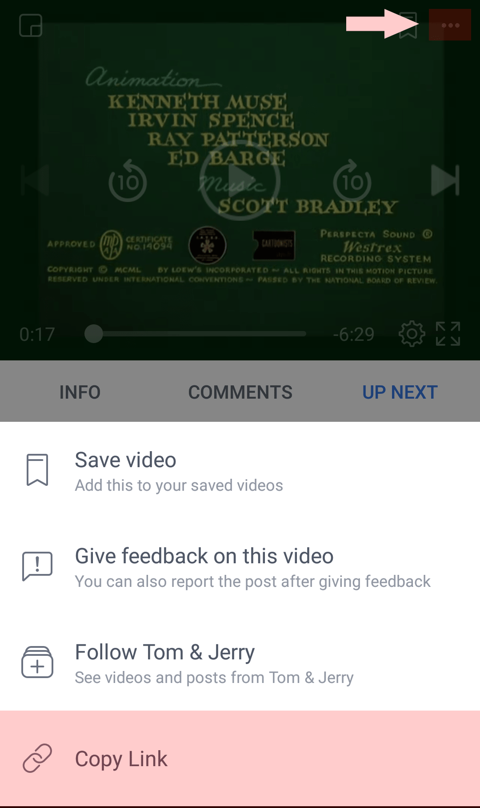

<div align="center">
  <a href="https://github.com/Ma7moud3ly/fbvd/blob/master/app/release/app-release.apk" target="_blank">
    
  </a>

# FBVD - Facebook Video Downloader

<div align="center">
  
  
  
</div>

#### Steps
```
Find a video on facebook and copy its link
```
<div>
  
  
</div>

```
Open FBVD application and do nothing..
```

<div>
  
</div>

```
You have to login with your facebook account for the first time.
```

<div>
  
</div>

```
Watch or Download your video...
```

<div>
  
</div>

<br>
[Download FBVD](https://github.com/Ma7moud3ly/fbvd/blob/master/app/release/app-release.apk) 
</div>
